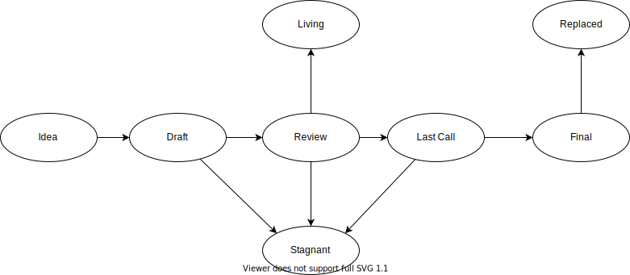

## What's is a CBP? 

Canister Builder Proposal(CBP) is committed to IC (Internet Computer) standardization and infrastructure construction.

## CBP Types

There are two kinds of CBP:
- A <strong> Standardization CBP</strong> describes proposed application standards/conventions.For example, token standards, NFT standards, etc, are used to develop specifications that Canister developers abide by. Standards Track CBPs consist of three parts—a design document, an implementation, and (if warranted) an update to the [formal specification]. 

- A <strong>Process CBP</strong> describes a process surrounding standardization，or proposes a change to (or an event in) a process.

It is highly recommended that a single CBP contain a single key proposal, whatever `Standardization CBP` or `Process CBP`. The more focused the CBP, the more successful it tends to be.

An CBP must meet certain minimum criteria. It must be a clear and complete description of the proposed `Standardization` or `Process`. 

## CBP Work Flow

### CBP Process 
The following is the standardization process for all CBPs in all tracks:

**Idea** - An idea that is pre-draft. This is not tracked within the EIP Repository.

**Draft** - The first formally tracked stage of an CBP in development. An CBP is merged by an CBP Editor into the CBP repository when properly formatted.

**Review** - An CBP Author marks an CBP as ready for and requesting Peer Review.

**Last Call** - This is the final review window for an CBP before moving to `Final`. An CBP editor will assign `Last Call` status and set a review end date (`last-call-deadline`), typically 14 days later.

If this period results in necessary normative changes it will revert the CBP to `Review`.

**Final** - This CBP represents the final standard. A Final CBP exists in a state of finality and should only be updated to correct errata and add non-normative clarifications.

**Replaced** - This CBP representative has been replaced by the new CBP. Replaced CBP exists in a state of finality and should not be updated.

**Stagnant** - Any CBP in `Draft` or `Review` or `Last Call` if inactive for a period of 6 months or greater is moved to `Stagnant`. An CBP may be resurrected from this state by Authors or CBP Editors through moving it back to `Draft` or it's earlier status. If not resurrected, a proposal may stay forever in this status. 

>*CBP Authors are notified of any algorithmic change to the status of their CBP*

**Living** - A special status for CBPs that are designed to be continually updated and not reach a state of finality. This includes most notably CBP-1.

## What belongs in a successful CBP?

Each CBP should have the following parts:

- Preamble - RFC 822 style headers containing metadata about the CBP, including the CBP number, a short descriptive title (limited to a maximum of 44 characters), a description (limited to a maximum of 140 characters), and the author details. Irrespective of the category, the title and description should not include CBP number. See [below](./cbp-0001.md#cbp-header-preamble) for details.
- Abstract - Abstract is a multi-sentence (short paragraph) technical summary. This should be a very terse and human-readable version of the specification section. Someone should be able to read only the abstract to get the gist of what this specification does.
- Motivation (*optional) - A motivation section is critical for CBPs that want to build standards. It should clearly explain what the standard means.
- Specification - The technical specification should describe the main features, secondary features, optional features, key definitions and interface definitions of the standard (optional).
- Rationale - The rationale fleshes out the specification by describing what motivated the design and why particular design decisions were made. It should describe alternate designs that were considered and related work, e.g. how the feature is supported in other languages. The rationale may also provide evidence of consensus within the community, and should discuss important objections or concerns raised during discussion.
- Reference Implementation - An optional section that contains a reference/example implementation that people can use to assist in understanding or implementing this specification.
- Security Considerations - All CBPs must contain a section that discusses the security implications/considerations relevant to the proposed change. Include information that might be important for security discussions, surfaces risks and can be used throughout the life-cycle of the proposal. E.g. include security-relevant design decisions, concerns, important discussions, implementation-specific guidance and pitfalls, an outline of threats and risks and how they are being addressed. CBP submissions missing the "Security Considerations" section will be rejected. An CBP cannot proceed to status "Final" without a Security Considerations discussion deemed sufficient by the reviewers.
- Copyright Waiver - All CBPs must be in the public domain. See the bottom of this CBP for an example copyright waiver.

## CBP Formats and Templates

CBPs should be written in [markdown](https://github.com/adam-p/markdown-here/wiki/Markdown-Cheatsheet) format. There is a [template](https://github.com/CBD-Group/CBP/blob/main/CBPs/cbp-template.md) to follow.

## CBP Header Preamble

Each CBP must begin with an [RFC 822](https://www.ietf.org/rfc/rfc822.txt) style header preamble, preceded and followed by three hyphens (`---`). This header is also termed ["front matter" by Jekyll](https://jekyllrb.com/docs/front-matter/). The headers must appear in the following order.

`cbp`: *CBP number* (this is determined by the CBP editor)

`title`: *The CBP title is a few words, not a complete sentence*

`description`: *Description is one full (short) sentence*

`author`: *The list of the author's or authors' name(s) and/or username(s), or name(s) and email(s). Details are below.*

`discussions-to`: *The url pointing to the official discussion thread*

`status`: *Draft, Review, Last Call, Final, Stagnant, Withdrawn, Living*

`last-call-deadline`: *The date last call period ends on* (Optional field, only needed when status is `Last Call`)

`type`: *One of `Standardization`, `Process`, or `Informational`*

`created`: *Date the CBP was created on*

`requires`: *CBP number(s)* (Optional field)

Headers that permit lists must separate elements with commas.

Headers requiring dates will always do so in the format of ISO 8601 (yyyy-mm-dd).

#### `author` header

The `author` header lists the names, email addresses or usernames of the authors/owners of the CBP. Those who prefer anonymity may use a username only, or a first name and a username. The format of the `author` header value must be:

> Random J. User &lt;address@dom.ain&gt;

or

> Random J. User (@username)

if the email address or GitHub username is included, and

> Random J. User

if the email address is not given.

It is not possible to use both an email and a GitHub username at the same time. If important to include both, one could include their name twice, once with the GitHub username, and once with the email.

At least one author must use a GitHub username, in order to get notified on change requests and have the capability to approve or reject them.

#### `discussions-to` header

While an CBP is a draft, a `discussions-to` header will indicate the URL where the CBP is being discussed.

The preferred discussion URL is a topic on [CBP issue](https://github.com/CBD-Group/CBP/issues). The URL cannot point to Github pull requests, any URL which is ephemeral, and any URL which can get locked over time (i.e. Reddit topics).

#### `type` header

The `type` header specifies the type of CBP: Standards Track, Meta, or Informational. If the track is Standards please include the subcategory (core, networking, interface, or ERC).

#### `category` header

The `category` header specifies the CBP's category. This is required for standards-track CBPs only.

#### `created` header

The `created` header records the date that the CBP was assigned a number. Both headers should be in yyyy-mm-dd format, e.g. 2001-08-14.

#### `requires` header

CBPs may have a `requires` header, indicating the CBP numbers that this CBP depends on.

## Linking to other CBPs

References to other CBPs should follow the format `CBP-N` where `N` is the CBP number you are referring to.  Each CBP that is referenced in an CBP **MUST** be accompanied by a relative markdown link the first time it is referenced, and **MAY** be accompanied by a link on subsequent references.  The link **MUST** always be done via relative paths so that the links work in this GitHub repository, forks of this repository, the main CBPs site, mirrors of the main CBP site, etc.  For example, you would link to this CBP with `[CBP-1](./cbp-0001.md)`.

## Auxiliary Files

Images, diagrams and auxiliary files should be included in a subdirectory of the `assets` folder for that CBP as follows: `assets/cbp-N` (where **N** is to be replaced with the CBP number). When linking to an image in the CBP, use relative links such as `../assets/cbp-0001/image.png`.

## Transferring CBP Ownership

It occasionally becomes necessary to transfer ownership of CBPs to a new champion. In general, we'd like to retain the original author as a co-author of the transferred CBP, but that's really up to the original author. A good reason to transfer ownership is because the original author no longer has the time or interest in updating it or following through with the CBP process, or has fallen off the face of the 'net (i.e. is unreachable or isn't responding to email). A bad reason to transfer ownership is because you don't agree with the direction of the CBP. We try to build consensus around an CBP, but if that's not possible, you can always submit a competing CBP.

If you are interested in assuming ownership of an CBP, send a message asking to take over, addressed to both the original author and the CBP editor. If the original author doesn't respond to the email in a timely manner, the CBP editor will make a unilateral decision (it's not like such decisions can't be reversed :)).

## CBP Editors

The current CBP editors are

- Witter Lee (@witterlee)
- Neeboo (@neeboo)
- Phili (@lshoo)

## CBP Editor Responsibilities

For each new CBP that comes in, an editor does the following:

- Read the CBP to check if it is ready: sound and complete. The ideas must make technical sense, even if they don't seem likely to get to final status.
- The title should accurately describe the content.
- Check the CBP for language (spelling, grammar, sentence structure, etc.), markup (GitHub flavored Markdown), code style

If the CBP isn't ready, the editor will send it back to the author for revision, with specific instructions.

Once the CBP is ready for the repository, the CBP editor will:

- Assign an CBP number (generally the PR number, but the decision is with the editors)

- Merge the corresponding [pull request](https://github.com/CBD-Group/CBP/pulls)

- Send a message back to the CBP author with the next step.

The CBP editors monitor CBP changes, and correct any structure, grammar, spelling, or markup mistakes we see.

The editors don't pass judgment on CBPs. We merely do the administrative & editorial part.

## Style Guide

### CBP numbers

When referring to an CBP by number, it should be written in the hyphenated form `CBP-X` where `X` is the CBP's assigned number.

### RFC 2119

CBPs are encouraged to follow [RFC 2119](https://www.ietf.org/rfc/rfc2119.txt) for terminology and to insert the following at the beginning of the Specification section:

> The key words “MUST”, “MUST NOT”, “REQUIRED”, “SHALL”, “SHALL NOT”, “SHOULD”, “SHOULD NOT”, “RECOMMENDED”, “MAY”, and “OPTIONAL” in this document are to be interpreted as described in RFC 2119.

## History

This document was derived heavily from [Bitcoin's BIP-0002](https://github.com/bitcoin/bips) written by Luke Dashjr and [Ethereum's EIP-1](https://github.com/ethereum/EIPs) written by Martin Becze , Hudson Jameson . In many places text was simply copied and modified. Although the BIP-0002 & EIP-1 text was written by Luke Dashjr, Martin Becze , and Hudson Jameson, they are not responsible for its use in the CBP Process, and should not be bothered with technical questions specific to CBD or the CBP. Please direct all comments to the CBP editors.

## Copyright

Copyright and related rights waived via [CC0](https://creativecommons.org/publicdomain/zero/1.0/).
