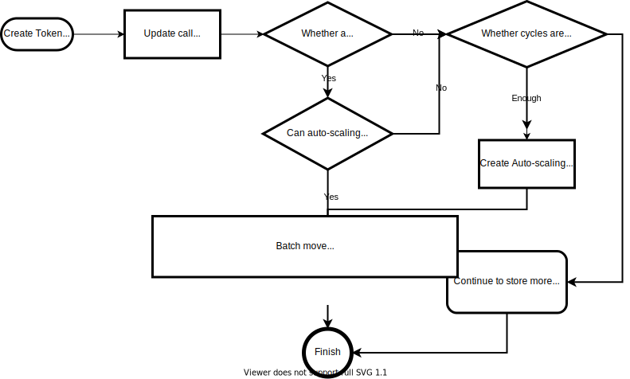

## Abstract

Fungible Token standard will help Dfinity ecosystem developers adopt the same standard and promote the prosperity of the Dfinity ecosystem

## Motivation

Blockchain technology brings trustless value circulation and breaks the boundaries of value circulation. At present, there are many innovations born on the blockchain. IC (Internet Computer) is a very good blockchain system, and more and more excellent products have been born on IC. Value circulation requires DEFI infrastructure to provide circulation support for various IC products, and Fungible Token Standard is DEFI's infrastructure, so it is very urgent to build a high-quality Fungible Token Standard.

## Rationale
### Rules of Token Standard Design

ERC20 is the first fungible token standard in the blockchain world, and it has been fully verified and recognized. It is necessary to refer to the existing ERC20 standard when designing the [Dfinity Fungible Token Standard].

The design of [Dfinity Fungible Token Standard] will follow the following rules:

1. **Improving the ERC20 standard**

2. **Suitable for Dfinity**

### Improve ERC20 standard

#### How to improve ERC20

ERC20 was created in the early days of Ethereum. During the development of the Eth ecosystem, the developer found that ERC20 was not perfect, so the developer designed the ERC223\ERC667\ERC777 standard to improve ERC20. We will design a better standard that combines the advantages of these standards.

1. ERC223
    - tries to solve the problem that the ERC20 transfer recipient (contract) does not support the transfer of tokens, and the transferred tokens will be lost (similar to sending tokens to a black hole address)

2. ERC667
    - adds transferAndCall which combines transfer function and call function, and solve the problems solved by ERC223

3. ERC777
    - use send function to replace transfer function
    - use the hook function to controls whether to accept transfer
    - use the operator authorization function to replace the approve function as a proxy transfer solution

#### Improved standards

```
service: {
  name: () -> (text) query;
  symbol: () -> (text) query;
  decimals: () -> (nat8) query;
  totalSupply: () -> (nat) query;

  balanceOf: (owner: principal) -> (nat) query;
  allowance: (owner: principal, spender: principal) -> (nat) query;
  approve: (spender: principal, value: nat) -> (bool);
  transferFrom: (sender: principal, receiver: principal, value: nat) -> (bool);
  transfer: (receiver: principal, value: nat, args:opt vec nat8) -> (bool);
}
```

## Suitable for Dfinity

### Problems to be solved

The design of Token Standard will consider the difference between Dfinity and Ethereum fully, and clarify the problems to be solved:

1. No atomicity similar to EVM cross-contract calls

- Solution: [sagas](https://www.cs.cornell.edu/andru/cs711/2002fa/reading/sagas.pdf) is a good solution

2. No built-in event-emit support similar to EVM

- Question: 
  - How do others know that the transaction happened？
  - How to check transaction history？

- Consideration: There are two ideas (Pubsub/Notify) for question 1 on the forum

  - When the Token is transferred, Notify informs the recipient, which can fill the missing EVENT. But When the Token recipient not a canister, which means can not notify, it is necessary to support query transaction history.

  - Token does not have sufficient reason to implement Pub/Sub to publish transaction information to a third party that is not the recipient.
  - Inter-canister calls are unsafe
- Solution: 
  - Notify/Pub/Sub should not be supported ; 
  - It's necessary to support query transaction history;

3. Built-in storage support

- Question: The current storage increase to 8G, but the memory storage is still 4G

- Consideration:

  - Tx history should support query
  - Tx history is important financial data and should be kept intact.
  - Built-in storage can support Token to store more self-describing information

- Solution:

  - Auto-scaling storage solution
  - Token standard implements self-description

4. Reverse gas model
 - Question: How to prevent ddos attacks
 - Consideration: The call of the canister does not require the caller to pay gas fees(canister pay the gas fees)

- Solution: Any update call to canister should be charged to the caller

5. There are two different identities in Dfinity, AccountID and Principal ID

- Question: Which identity to use as a token standard user？

- Consideration: 
    - AccountID is based on Principal ID,Principal ID is simpler and more straightforward
    - Account ID for better privacy protection

- Solution: It is necessary for the Token standard to be compatible with both identity, in order to meet the needs of different identity scenarios

6. No black hole address

- Question: If there is a need to destroy Token, how to deal with it?
- Consideration: Whether to implement the burn interface should be considered in the Token standard

- Solution: The burn interface does not need to be put into the standard, it can be designed in the extension interface

7. approve/transferFrom (Approve is a pairing function for TransferFrom)

- Question: There was a disagreement about whether the approval/transfer should be removed in the discussion on the forum

- Consideration:

  approve/transferFrom appears in ERC20 mainly because:

  > Using Ethereum's native ETH token, you can call the smart contract function and send ETH to the contract at the same time. This is done using payable. But because the ERC20 token itself is a smart contract, it is not possible to directly send the token to the smart contract while calling one of its functions; therefore, the ERC20 standard allows smart contracts to transfer tokens on behalf of the user-using the transferFrom() function. For this, users need to allow smart contracts to transfer these tokens on their behalf

  However, in the Dex and lending scenarios of Ethereum, Approve is often accompanied by the possibility of simultaneous operation of two tokens. Approve can avoid the repeated payment problem which transaction brought about, has a good supplementary use scenario for transfer.

- Solution: Approve/transferFrom should be retained

8. TransferAndCall vs Receiver Notify
- Question: which option is more suitable
- Consideration:
  - Notify can meet the basic notification needs. Although it cannot support better flexibility, it is sufficient to meet the transfer scenario
  - TransferAndCall provides better flexibility, but it depends on the transfer caller to fully understand the method and parameters corresponding to the call, which is not needed for most transfer scenarios
  - For security reasons, do not call the canister of the location inside the canister,[why?Inter-canister calls](https://www.joachim-breitner.de/blog/788-How_to_audit_an_Internet_Computer_canister)
  
- Solution: 
  - Neither is supported

9. ApproveAndCall VS TransferAndCall

- Question: We compare ApproveAndCall and TransferAndCall. ApproveAndCall and TransferAndCall are two sets of non-atomic operations, there is no difference essentially. Which one should be retained?

- Consideration: In some scenarios, when multiple Tokens need to be transferred at the same time, TransferAndCall can not meet such needs. After approval, execute transferFrom in the final call to pay multiple tokens at once
- For security reasons like Q8

- Solution: call is not supported

10. Nonce

- Question: What Is Nonce In Ethereum? every transaction has a nonce. The nonce is the number of transactions sent from a given address. Each time you send a transaction, the nonce increases by 1. There are rules about what transactions are valid, and the nonce is used to enforce some of these rules. Does Dfinity's token standard need to incorporate a nonce mechanism?

- Consideration:
   - Every ingress message sent to the IC has a nonce generated to ensure that a transaction can't be resent.
   - This second nonce (created_at_time field) helps ensure that each transaction is globally unique.

- Solution: Support created_at filed as the second nonce

#### What other functions does the Dfinity Fungible Token standard need to implement?
 
**Information self-describing**

Etherscan, MyEthereumWallet, Imtoken, TokenPocket, Dapp all have more information requirements for ERC20, such as Logo, introduction, white paper, social media, official website, contact information, etc. Each of them that needs this information needs to be maintained independently, so information appears Inconsistent. It is necessary to solve this problem through the design of <strong>[Dfinity Fungible Token Standard]</strong>

## Specification
Based on the section [Rationale](./cbp-0002.md#Rationale), We derive the following features.

**Major Features**

These are the indispensable parts of Fungible Token Standard, and it is easier for everyone to reach a consensus on this part.

These features must be added to the standard.

```yml
Property   : Name/Symbol/Decimals/TotalSupply/Fee
Method     : balanceOf/transfer
History    : Transaction histories
```

**Secondary Features**

<strong>Third Party Transfer</strong> 

Simplify the payment process. For example, in the official ICP payment example, if ICP supports `approve/tranferFrom`, the original payment process (`transfer`->fetch transfer result->confirm payment success) can be replaced with a more simplified process (`approve`-> Confirm payment by calling `tranferFrom` directly to complete the payment process).

But too much allowance data will face storage limitations.

Considering that the storage of the canister will be expanded to 300GB in the future.

this feature should be added to the standard.

<strong>Burn</strong>

`burn/burnFrom` is not a necessary feature of all fungible tokens, so it is not added to the standard and exists as an extensible feature.

<strong>Mint</strong>

`mint` is not a necessary feature of all fungible tokens, so it is not added to the standard and exists as an extensible feature.

```yml
3 Party Transfer : Approve/Transfer
Burn: Burn/BurnFrom
Mint: Mint Token
```

**Optional Features**

Optional features mean that the basic use of the standard will not be affected without them, but if the addition of these optional features will not bring negative effects, it is recommended to be added to the standard to enhance the standard's feature set.

The following features are only read and write of specific properties, and do not involve operations involving security such as balance.

These features should be added to the standard.

```
Self Description : Logo/Twitter/WhitePaper/DSVR etc.
Http Interface: Token Info/Metrics/Logo/Name/Symbol/TotalSupply
```

**Definition of key elements**

<strong>Token Holder</strong>

There are currently two formats of identity on IC: `AccountIdentifier & Principal`,AccountIdentifier can be encoded by Principal through a specific algorithm. In essence, AccountIdentifier is an extension of Principal. AccountIdentifier is designed to protect privacy, but in any case, it is a fact that there are two formats of identity.
For better compatibility, Token Holder compatible with AccountIdentifier and Principal is a better choice.

<strong>Unique Tx ID</strong>

A unique transaction id that helps users identify transactions.
As we all know, the canister id is unique. The transaction id inside the token canister can be identified by using a simple auto-increment number to reduce the storage space occupation of the id. A globally unique txid can be generated by encoding the token canister id + tx seq no.

<strong>Auto Scaling Storage</strong>

At present, the canister storage has been increased to 8G, but the memory storage is still 4G. There is no storage API similar to the file system currently, which means that only 4G storage can be used. When we want to support saving more token transaction history, 4G storage will become a limitation.

Auto-scaling storage will solve the problems mentioned above.

How does auto-scaling storage work?



**Based on the above specification, the did interface specification is as follows**

### Data Definition
#### CallData
```rust
/* 
  Error
  - code : Error code
  - msg : Error message
*/
type Error = record { code : nat32; message : text };
```

#### Fee
```rust
/*
  Fee include minimum and rate
  How to calc fee? fee = math.Max( transferValue * rate , minimum) 
*/
type Fee = record { rate : nat; rate_decimals : nat8; minimum : nat };
```
#### MetaData
```rust
/*
  MetaData of token
  includes: 
          fee setting
          decimals
          name
          totalSupply
          symbol
*/
type MetaData = record { fee : Fee; decimals : nat8; name : text; totalSupply : nat; symbol : text; };
```
#### TxRecord
```rust
/*
  Transaction Record of token
  includes: 
          Approve transaction record
          Transfer transaction record
*/
type TxRecord = variant {
  Approve : record { nat; TokenHolder; TokenHolder; TokenHolder; nat; nat; nat64; nat64; };
  Transfer : record { nat; TokenHolder; TokenHolder; TokenHolder; nat; nat; nat64; nat64; };
};
```
#### CommonResult
```rust
/*
  CommonResult
      Ok bool
      Error
        - code : Error code
        - msg : Error message
*/
type CommonResult = variant { Ok : bool; Err : Error };
```
#### TxRecordsResult
```rust
/*
  TxRecordsResult
      Ok transaction record list
      Error
        - code : Error code
        - msg : Error message
*/
type TxRecordsResult = variant { Ok : vec TxRecord; Err : Error };
```
#### TxRecordResult
```rust
/*
  TxRecordResult
      Ok TxRecord
      Error 
        - code : Error code
        - msg : Error message
      Forward query transaction record when the tx store in the auto-scaling storage
*/
type TxRecordResult = variant { Ok : Transaction; Err : Error; Forward : principal; };
```
#### TokenHolder
```rust
/*
  TokenHolder
     Both support Account ID(ledger account ID) and Principal ID
*/
type TokenHolder = variant { None; Account : text; Principal : principal };
```
#### TokenInfo
```rust
/*
  TokenInfo
     The information of token
*/
type TokenInfo = record {
  allowanceSize : nat;
  feeTo : TokenHolder;
  owner : principal;
  cycles : nat64;
  txCount : nat;
  holders : nat;
  storages : vec principal;
};
```
#### TransactionResponse
```rust
/*
  TransactionResponse
    Response type of method approve/burn/transfer/transferFrom 
*/
type TransactionResponse = record { txid : text; error : opt Error };
```
#### TransactionResult
```rust
/*
  TransactionResult
    Result type of method approve/burn/transfer/transferFrom
    Error :
        - code : Error code
        - msg : Error message
*/
type TransactionResult = variant { Ok : TransactionResponse; Err : Error };
```

### Interface
#### name
```rust
  // Return token's name
  name : () -> (text) query;

```
#### symbol
```rust
  // Return token's symbol
  symbol : () -> (text) query;
```
#### decimals
```rust
  // Return token's decimals
  decimals : () -> (nat8) query;
```
#### totalSupply
```rust
  // Return token's totalSupply
  totalSupply : () -> (nat) query;
```
#### fee
```rust
  // Return token's fee setting
  fee : () -> (Fee) query;
```
#### setFee
```rust
  // Set token's fee setting
  setFee : (Fee) -> (bool);
```
#### setFeeTo
```rust
  // Any fee will send to the feeHolder
  setFeeTo : (feeHolder: text) -> (bool);
```
#### meta
```rust
  // Return all of the meta data of a token.
  meta: () -> (MetaData) query;
```
#### desc
```rust
  // Return all of the description information of a token.
  // supported keys:
  //   OFFICIAL_SITE, OFFICIAL_EMAIL, DESCRIPTION, WHITE_PAPER
  //   MEDIUM, BLOG, REDDIT, SLACK, FACEBOOK, TWITTER,
  //   GITHUB, TELEGRAM, WECHAT, LINKEDIN, DISCORD,
  //   DSCVR, OPENCHAT, DISTRIKT, WEACT

  desc: () -> (vec record { text; text }) query;
```

#### setDesc
```rust
  // Set description information of a token.
  // supported keys:
  //   OFFICIAL_SITE, OFFICIAL_EMAIL, DESCRIPTION, WHITE_PAPER
  //   MEDIUM, BLOG, REDDIT, SLACK, FACEBOOK, TWITTER,
  //   GITHUB, TELEGRAM, WECHAT, LINKEDIN, DISCORD,
  //   DSCVR, OPENCHAT, DISTRIKT, WEACT
  setDesc : (vec record { text; text }) -> (bool);
```
#### logo
```rust
  // Return token logo data (image data)
  logo : () -> (vec nat8) query;
```
#### setLogo
```rust
  // Set the logo of a token, should support jpg/gif/png/webp/svg
  setLogo : (logo : vec nat8) -> (bool);
```
#### balanceOf
```rust
  // Returns the account balance of another account with address owner.
  balanceOf: (holder: text) -> (nat) query;
```

#### owner
```rust
  // Return token's owner
  owner : () -> (principal);
```
#### setOwner
```rust
  // Set the token owner
  //    owner can invoke [setFee, setFeeTo, setLogo, setDesc, setOwner]
  setOwner : (owner: principal) -> (bool);
```
#### tokenInfo
```rust
  // Return token's info:
  // owner: OWNER,
  //          holders: total holder count of the token,
  //          allowance_size: total allowance count of the token,
  //          fee_to: feeHolder,
  //          tx_count: total transaction count of the token,
  //          cycles: cycles balance of the token
  //          storages : auto-scaling storage canister ids
  tokenInfo : () -> (TokenInfo) query;
```
#### allowance
```rust
  // Returns the amount which spender is still allowed to withdraw from owner.
  allowance:(owner: text, spender: text)->(nat) query;
```
#### approve
```rust
  // Allows `spender` to withdraw from your account multiple times, up to the `value` amount.
  // If this function is called again it overwrites the current allowance with value.
  approve: (fromSubAccount: opt vec nat8, spender: text, value: nat, created_at: opt nat64) -> (TransactionResult);
```
#### allowancesOf
```rust
  //Get all allownances of the holder
  allowancesOf : (holder: text) -> (vec record { TokenHolder; nat }) query;
```
#### transferFrom
```rust
  // Transfers value amount of tokens from `address from` to [address to].
  // The transferFrom method is used for a withdraw workflow, allowing canister
  // to transfer tokens on your behalf.
  // If the receiver's (`to`) notification hook function exists,  will be called.
  transferFrom: (spenderSubAccount: opt vec nat8, from: text, to: text, value: nat, created_at: opt nat64) ->(TransactionResult);
```
#### transfer
```rust
  // Transfer from account:
  //      1. `fromSubAccount` is not null : Use the accountId generated based on the caller's Principal and the provided `fromSubAccount`
  //      2. `fromSubAccount` is  null    : Use caller's Principal
  // Then transfer `value` from the holder to `to` , return TransferResponse
  // `to` can be an AccountId , a Principal,or a canister id (If the container has a notification hook function, a notification will be triggered).
  // Transfer 0 value ​​will be reject.
  transfer: (fromSubAccount:opt vec nat8, to: text, value: nat, created_at: opt nat64) -> (TransactionResult);
```
#### lastTransactions
```rust
  // Get last transcation of the token, max size is 200
  lastTransactions : (size: nat64) -> (TxRecordsResult) query;
```
#### transactionById
```rust
  // Get transcation information by id
  // If not exist in the token, return the storage canister id of the transaction located
  // Call transactionById to the storage canister id again ,will return the transaction information.
  transactionById : (transactionId: text) -> (TxRecordResult) query;
```
#### transactionByIndex
```rust
  // Get transcation information by tx index
  // If not exist in the token, return the storage canister id of the transaction located
  // Call transactionById to the storage canister id again ,will return the transaction information.
  transactionByIndex : (nat) -> (TxRecordResult) query;
```

#### http_request
```rust
  // Http interface
  //  support uri path:
  //    1. /             : return token info & metrics info
  //    2. /logo         : return the logo of token
  //    3. /name         : return the name of token
  //    4. /symbol       : return the symbol of token
  //    5. /totalsupply  : return the totalsupply of token
  //    6. /decimals     : return the decimals of token
  http_request : (req: HttpRequest) -> (HttpResponse) query;
```

## Burnable Extension API
#### burn
```rust 
  burn : (opt vec nat8, nat) -> (TransactionResult);
```
#### burnFrom
```rust 
  burnFrom : (opt vec nat8, text, nat) -> (TransactionResult);
```
## Mintable Extension API
#### mint
```rust 
  mint : (text, nat) -> (TransactionResult);
```

## Reference Implementation

At present, the above specification already has an implementation

**Source Code**

[https://github.com/Deland-Labs/dfinity-fungible-token-standard](https://github.com/Deland-Labs/dfinity-fungible-token-standard)

**Document**

[https://dft.delandlabs.com](https://dft.delandlabs.com)

## Security Considerations

**Canister Contoller**
Canister is completely controlled by the controller, so if the controller does evil, the fungible token will be affected. How to solve this problem?

- One solution is to set the controller to aaaaa-aa (the management canister) when the fungible token is released, which means that the issuer has given up the controller authority, thus ensuring the security of the fungible token
- Another potential solution is SNS, which is designed to control canisters through voting, which has not yet been released.
  
**Canister Code Security**

The canister module hash is stable, which can be used to determine the security of the code. In the future, a better way to verify the security of the deployed code is needed.

## Copyright
Copyright and related rights waived via [CC0](https://creativecommons.org/publicdomain/zero/1.0/).


## References

- [1] [Dfinity Developer Center: Canister interface](https://sdk.dfinity.org/docs/interface-spec/index.html#system-api-imports)

- [2] [Dfinity Forum: thoughts-on-the-token-standard](https://forum.dfinity.org/t/thoughts-on-the-token-standard/4694)

- [3] [Toniq-Labs: ic-fungible-token](https://github.com/Toniq-Labs/ic-fungible-token)

- [4] [SuddenlyHazel: Token-Standard](https://github.com/SuddenlyHazel/token-standard/pull/1)

- [5] [Dfinance-tech: ic-token](https://github.com/dfinance-tech/ic-token)

- [6] [Plug: Token-Standard](https://github.com/Psychedelic/standards)

- [7] [Ethereum: EIPS-EIP20 & EIP667 & EIP777 & EIP1820](https://github.com/ethereum/EIPs)

- [8] [Candid](https://github.com/dfinity/candid/)

- [9] [Why are ERC20 allowances necessary?](https://kalis.me/unlimited-erc20-allowances/)

- [10] [sudograph](https://github.com/sudograph/sudograph)

- [11] [Dfinity Self Describing Standard](https://github.com/Deland-Labs/dfinity-self-describing-standard)

- [12] [How to audit an Internet Computer canister](https://www.joachim-breitner.de/blog/788-How_to_audit_an_Internet_Computer_canister)

- [13] [infinity-swap: IS20](https://github.com/infinity-swap/IS20)

- [14] [ICLighthouse: DRC20](https://github.com/iclighthouse/DRC_standards)

