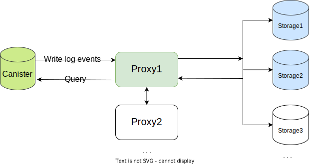
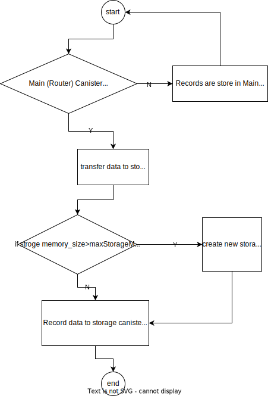
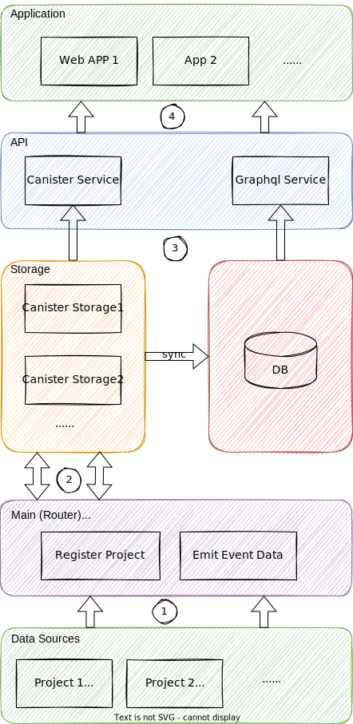

## Abstract
ICES (Internet Computer Event System) is a storage and analysis service for canister's event logs on Dfinity. 

## Motivation
Limited by the storage size of Canister, if you want to store log event data in canister, you need to consider implementing an expansion plan. This increases the complexity of the Canister contract and the difficulty of maintenance.  ICES not only provides log storage and analysis solutions, but also provides front-end display pages. It is simple to use, users do not need to consider storage issues, 100% of the log data is stored on the chain, and query APIs and display pages are provided.

## Specification

### Which users need to use the ICES?
Canisters deployed on the IC main network can be used

### Design & Technology Architecture

#### Canister Architecture

#### auto-scaling storage
The Main (Router) Canister caches 1000 event log data. When n>=1000, judge whether the current storage has reached the limit. Create a new storage when memorySize>maxStorageMemorySize, and start transferring data to the storage canister when memorySize<=maxStorageMemorySize , Record the starting index of the current canister log record. Synchronize data through index.

#### Overall Architecture

### How to use ICES?

#### Motoko SDK Getting started
* [ICES Motoko Library](https://github.com/icpfans-xyz/ices-motoko-library)
* [ICES Motoko Library example](https://github.com/icpfans-xyz/ices-contract/tree/main/example/motoko)
 

#### Rust SDK Getting started
* [ICES Rust SDK](https://github.com/icpfans-xyz/ices-contract/tree/main/sdk)
* [ICES Rust SDK example](https://github.com/icpfans-xyz/ices-contract/tree/main/example/rust)

#### Explorer Getting started
* Access [ICES Explorer](https://explorer.ices.one/) 
* [Explorer Tutorial](https://doc.ices.one/guide/explorer)

### What are the specific benefits of using the ICES?
1. Fee to use 
2. Simple Integration
3. Permanent Data Storage
4. GraphQL/Restful API
5. Explorer UI

## Rationale
Canister storage auto-scaling, providing front-end data presentation and dashborad

## Reference Implementation

## Security Considerations

## Copyright

